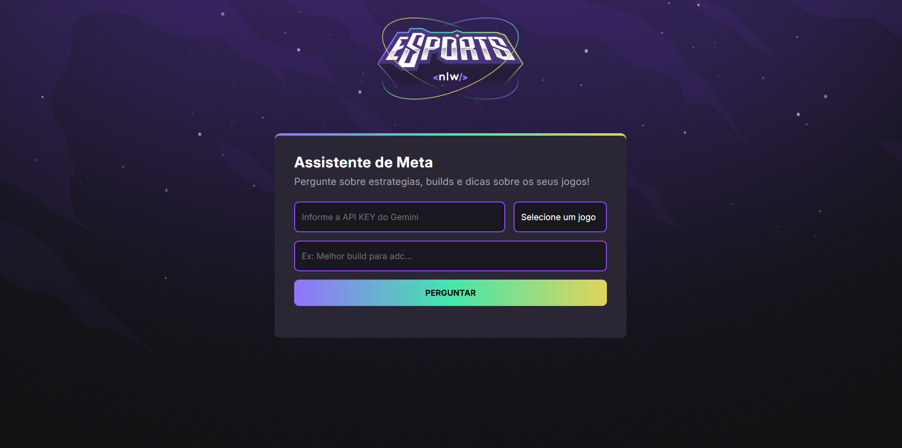

# 🎮 Assistente de Meta IA (AI Meta Assistant)

Um projeto web interativo que atua como um **Assistente de Meta para Jogos**, utilizando a inteligência artificial do Google Gemini para fornecer informações atualizadas sobre estratégias, *builds* e dicas de jogo. Melhore seu desempenho e mantenha-se à frente do *meta* nos seus jogos favoritos!  

## 🔗 Acesse e Teste Agora

Acesse a aplicação online para testar o Assistente de Meta diretamente no seu navegador:

**Link:** [https://assist3nt-m3ta-a1.netlify.app](https://assist3nt-m3ta-a1.netlify.app)

---

## 🚀 Como Usar (Instruções)

Para utilizar o Assistente de Meta na página web, siga os passos abaixo na interface da aplicação:

1.  **Chave Gemini (API Key):** Obtenha sua chave de API do Gemini e insira-a no campo "Informe a API KEY do Gemini".
2.  **Selecione o Jogo:** Escolha o jogo desejado no menu suspenso.
3.  **Faça a Pergunta:** No campo de texto, digite sua pergunta em busca de *builds*, estratégias, ou dicas do jogo.
4.  **Perguntar:** Clique no botão **Perguntar** para obter a resposta da IA.

## ✨ Funcionalidades

O assistente permite que o usuário faça perguntas específicas sobre o *meta* de jogos selecionados e receba respostas concisas, formatadas em Markdown e baseadas em conhecimento atualizado.

* **Seleção de Jogos:** Suporte para múltiplos jogos como League of Legends, Valorant, CS:GO, COD: Warzone e Pokemon Go.
* **Assistência Especializada:** O modelo de IA é configurado como um especialista em *meta* do jogo selecionado, respondendo perguntas sobre *builds*, estratégias, e dicas.
* **Resposta Direta e Concisa:** Respostas limitadas a no máximo 500 caracteres, focadas em ser diretas e sem saudações ou despedidas.
* **Atualização do Meta:** A IA é instruída a realizar pesquisas atualizadas (utilizando a ferramenta `Google Search`) para basear suas respostas no *patch* ou na versão mais recente do jogo.
* **Design Moderno:** Interface de usuário com tema escuro (`background-color: #121214`) e animações leves (`@keyframes appear`, `@keyframes pulse`).

## 🛠️ Tecnologias Utilizadas

Este projeto é uma aplicação *Front-end* construída com as seguintes tecnologias:

* **HTML5**
* **CSS3** (Estilização com fontes Google Fonts e *design* inspirado em eSports)
* **JavaScript (ES6+):** Lógica da aplicação e comunicação assíncrona com a API.
* **Google Gemini API:** Utilizado para gerar as respostas inteligentes.
    * Modelo: `gemini-2.0-flash`
    * Ferramenta: `Google Search` (habilitada)
* **Showdown.js:** Biblioteca externa para converter Markdown em HTML.
